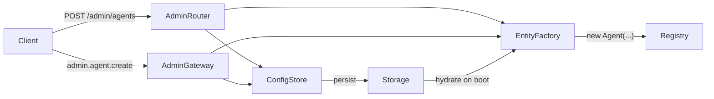

# Admin API

The `@radaros/admin` package provides CRUD endpoints for dynamically managing agents, teams, and workflows at runtime. Entities are persisted to a storage backend and automatically hydrated into the live registry on server restart.

---

## Architecture



- **AdminRouter** — Express router with REST CRUD endpoints
- **AdminGateway** — Socket.IO event handlers with real-time broadcasts
- **ConfigStore** — Persists serializable blueprints to any `StorageDriver`
- **EntityFactory** — Resolves blueprints into live `Agent`/`Team` instances via `modelRegistry`
- **Hydration** — On startup, reads all saved configs and re-creates entities into the registry

---

## Installation

<Tabs>
  <Tab title="npm">
    ```bash
    npm install @radaros/admin
    ```
  </Tab>
  <Tab title="pnpm">
    ```bash
    pnpm add @radaros/admin
    ```
  </Tab>
</Tabs>

---

## Quick Start (Express)

```typescript
import express from "express";
import { SqliteStorage } from "@radaros/core";
import { createAgentRouter } from "@radaros/transport";
import { createAdminRouter } from "@radaros/admin";

const app = express();
app.use(express.json());

const { router, hydrate } = createAdminRouter({
  storage: new SqliteStorage("radaros.db"),
  toolLibrary: { webSearch: webSearchTool, calculator: calcTool },
});

await hydrate(); // re-create persisted entities on startup

app.use("/admin", router);            // CRUD management
app.use("/api", createAgentRouter()); // auto-discovers from registry

app.listen(3000);
```

## Quick Start (Socket.IO)

```typescript
import { Server } from "socket.io";
import { SqliteStorage } from "@radaros/core";
import { createAgentGateway } from "@radaros/transport";
import { createAdminGateway } from "@radaros/admin";

const io = new Server(httpServer);

const { hydrate } = createAdminGateway({
  io,
  storage: new SqliteStorage("radaros.db"),
  toolLibrary: { webSearch: webSearchTool, calculator: calcTool },
  namespace: "/radaros-admin",
});

await hydrate();

createAgentGateway({ io }); // auto-discovers from registry
```

---

## AdminOptions

<ParamField body="storage" type="StorageDriver" required>
  Storage backend for persisting blueprints. Any `StorageDriver` works: `InMemoryStorage`, `SqliteStorage`, `PostgresStorage`, `MongoDBStorage`.
</ParamField>

<ParamField body="toolLibrary" type="Record<string, ToolDef>">
  Named tools available for agent creation. Users reference tools by key name in blueprints.
</ParamField>

<ParamField body="middleware" type="RequestHandler[]">
  Express middleware applied to all admin routes (e.g., authentication).
</ParamField>

---

## Hydration

Call `hydrate()` once at startup to re-create all persisted entities into the live registry:

```typescript
const counts = await hydrate();
console.log(counts);
// { agents: 3, teams: 1, workflows: 0 }
```

This reads all saved blueprints from storage, resolves them via `EntityFactory` (model providers, tools, team members), and creates live instances that auto-register into the global registry. Existing entities with the same name are skipped.
